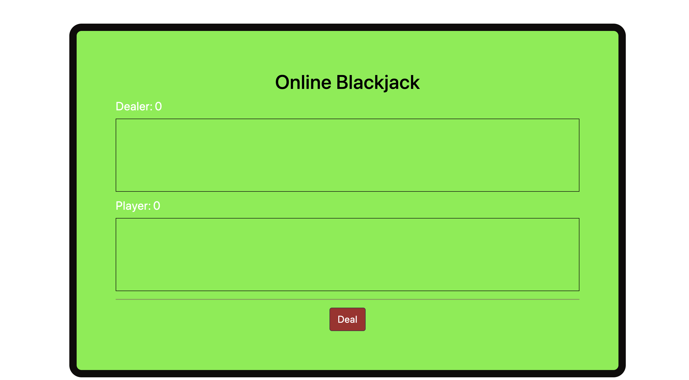
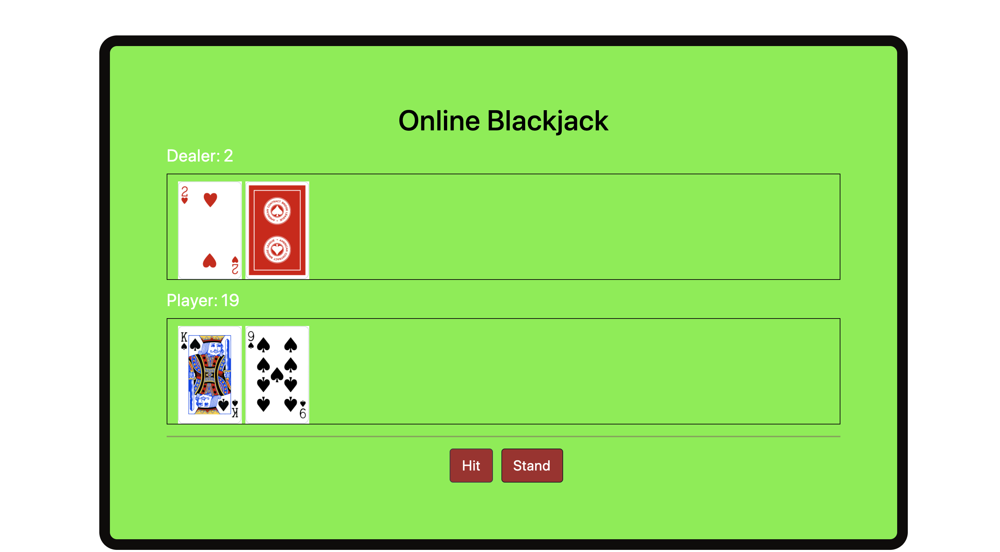
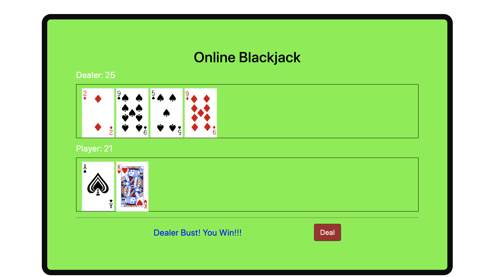
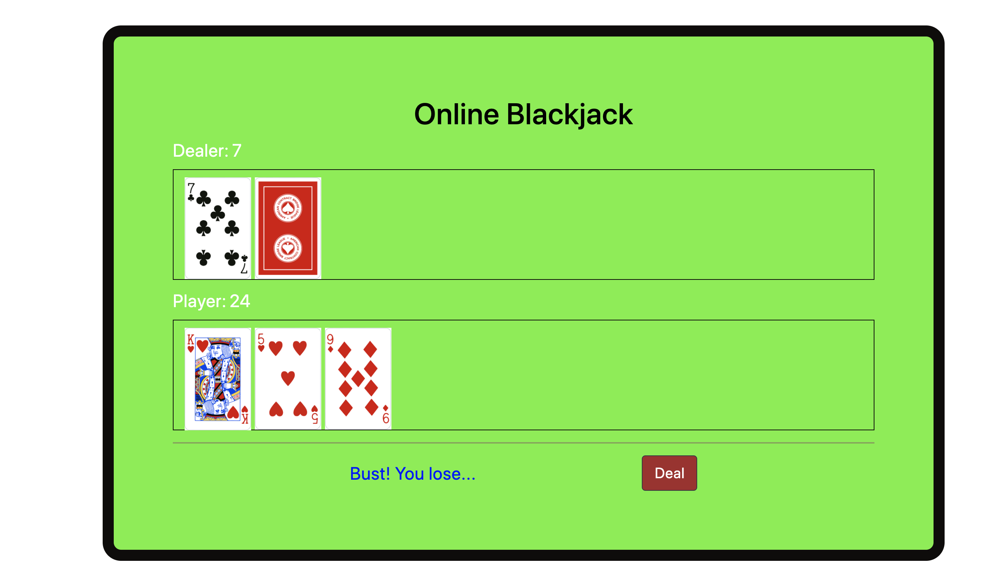

<h1>Blackjack Game</h1>

<h2>Introduction</h2>
This is a classic 21 Blackjack card game. The objective of this game is to beat the dealer, and it can be done with the following options:

<li>Get 21 points on the player's first two cards, without a dealer blackjack.</li>
<li>Reach a final score that is higher than the dealer's without exceeding 21 points.</li>
<li>Let the dealer draw an additional card until his or her hand exceeds 21 points.</li>

<h2>Technologies </h2>
<li>HTML</li>
<li>CSS</li>
<li>Javascript</li>
<li>JQuery</li>

<h2>Images</h2>

<h2>Code</h2>
To see the full code, please visit <a href="https://github.com/Chris-Humphrey/Blackjack-Game">Blackjack Game</a> on Github.

<h2>Author</h2>
Meryem Komur
